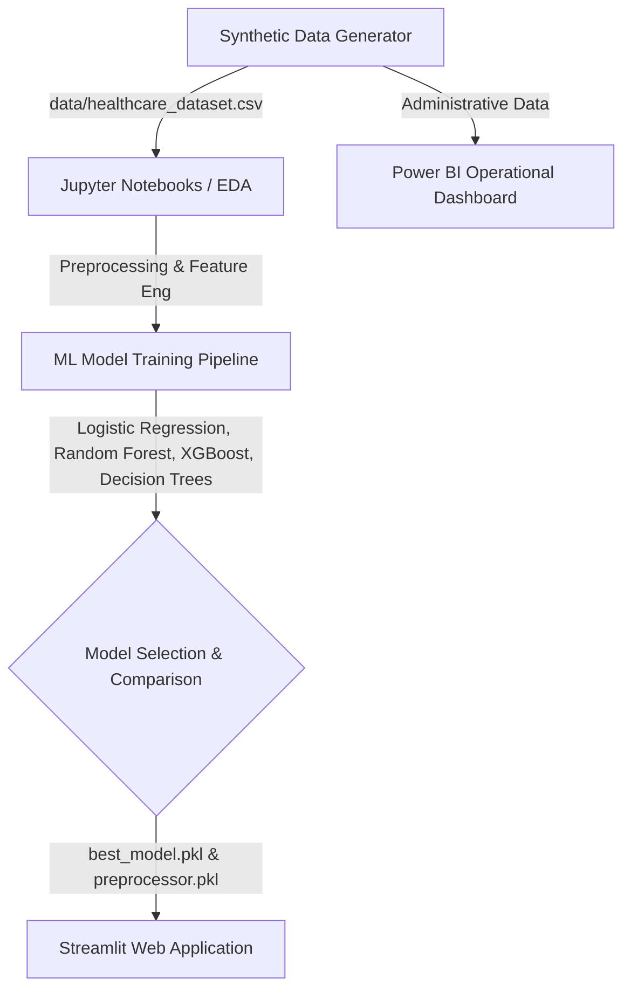

# 🏥 Healthcare Analytics Platform

An end-to-end clinical and administrative healthcare analytics platform designed to predict patient stroke risk using Machine Learning and report hospital operational metrics. This project is structured as a professional portfolio piece for Data Analysts and Data Scientists.

---

## 🏗️ Project Architecture & Pipeline



---

## 📁 Repository Structure

```text
Healthcare-Analytics-Platform/
├── data/
│   └── healthcare_dataset.csv          # Clinical and administrative patient data
├── notebooks/
│   ├── 01_eda.ipynb                    # Exploratory Data Analysis (Outliers, Correlations)
│   ├── 02_data_preprocessing.ipynb     # Missing value imputation & Label Encoding
│   ├── 03_feature_engineering.ipynb    # Feature scaling (StandardScaler)
│   ├── 04_model_building.ipynb         # Machine learning model training
│   └── 05_model_evaluation.ipynb       # Confusion matrix, ROC-AUC comparisons
├── src/
│   ├── generate_synthetic_data.py      # Programmatic generator for realistic clinical data
│   ├── create_notebooks.py             # Utility to generate structured Jupyter Notebooks
│   ├── data_loader.py                  # Modular data ingestion and validation check
│   ├── preprocessing.py                # Preprocessing class for fitting and transformation
│   ├── train_model.py                  # End-to-end model training execution pipeline
│   └── utils.py                        # Diagnostic plotting utilities
├── models/
│   ├── best_model.pkl                  # Fitted model weights (Logistic Regression)
│   └── preprocessor.pkl                # Preprocessor state mappings
├── reports/
│   ├── Logistic_Regression_confusion_matrix.png
│   ├── Logistic_Regression_roc_curve.png
│   ├── Logistic_Regression_feature_importance.png
│   └── model_comparison_report.csv
├── app/
│   └── streamlit_app.py                # Predictive Streamlit dashboard web application
├── dashboard/
│   ├── PowerBI_Dashboard.pbix          # Power BI report template
│   └── PowerBI_Dashboard_Guide.md      # DAX formulas, measures, and styling guidelines
├── requirements.txt                    # Project dependencies
├── README.md                           # Documentation
└── .gitignore                          # Git exclusions
```

---

## 📊 Model Performance Summary

Four classification models were trained and compared using **ROC-AUC** (Area Under the Receiver Operating Characteristic Curve) as the primary metric, which balances sensitivity and specificity for clinical screening:

| Model | Accuracy | Precision | Recall | F1-Score | ROC-AUC |
| :--- | :---: | :---: | :---: | :---: | :---: |
| **Logistic Regression** | **78.40%** | **69.67%** | **51.88%** | **59.47%** | **0.8187** |
| **Random Forest** | 78.05% | 72.05% | 45.99% | 56.14% | 0.8120 |
| **XGBoost** | 77.20% | 67.18% | 49.59% | 57.06% | 0.8111 |
| **Decision Tree** | 77.40% | 68.11% | 48.94% | 56.95% | 0.7940 |

> [!NOTE]
> Logistic Regression was selected as the production model due to its high ROC-AUC and excellent interpretability of features (clinical coefficients).

---

## ⚙️ Quick Start & Installation

Follow these steps to set up the project on your local machine:

### 1. Clone or Download the Project
Make sure you are in the project root directory:
```bash
cd Healthcare-Analytics-Platform
```

### 2. Set Up a Virtual Environment
```bash
# Create a virtual environment named .venv
python -m venv .venv

# Activate the virtual environment
# On Windows (Command Prompt):
.venv\Scripts\activate
# On Windows (PowerShell):
.venv\Scripts\Activate.ps1
# On macOS/Linux:
source .venv/bin/activate
```

### 3. Install Dependencies
```bash
pip install -r requirements.txt
```

### 4. Generate the Dataset
Create the synthetic patient dataset:
```bash
python src/generate_synthetic_data.py
```

### 5. Train the Models
Train and serialize the preprocessing and machine learning model files:
```bash
python src/train_model.py
```

### 6. Run the Streamlit Application
Launch the interactive web-based risk predictor:
```bash
streamlit run app/streamlit_app.py
```

---

## 📊 Power BI Dashboard Specifications

The `dashboard/` directory contains complete guidelines to replicate the operational executive report. 

### Key DAX Measures
* **Total Patients**: `Total Patients = COUNT(healthcare_dataset[Patient_ID])`
* **Stroke Incidence Rate**: `Stroke Rate = DIVIDE(CALCULATE([Total Patients], healthcare_dataset[Stroke] = 1), [Total Patients], 0)`
* **Operational Billing**: `Total Billing = SUM(healthcare_dataset[Billing_Amount])`

---

## 🐙 Git & GitHub Deployment Walkthrough

To host this project on your GitHub portfolio, follow this step-by-step beginner guide:

### Step 1: Initialize Git Local Repository
Initialize Git, check status, and ensure files are tracked properly:
```bash
git init
git status
```

### Step 2: Commit All Code Files
Stage all files (excluding files ignored by `.gitignore` such as `.venv`, datasets, and local binaries) and write a descriptive commit message:
```bash
git add .
git commit -m "feat: initial commit of healthcare analytics platform code, models, and docs"
```

### Step 3: Create Repository on GitHub
1. Log in to [GitHub](https://github.com).
2. Click the **New** button to create a repository.
3. Set the **Repository name** to `Healthcare-Analytics-Platform`.
4. Leave it **Public** (recommended for portfolio reviews).
5. Do **not** check "Add a README file", "Add .gitignore", or "Choose a license" since we already have these files locally.
6. Click **Create repository**.

### Step 4: Link Local Repo to GitHub & Push
Copy the remote repository URL from GitHub and run:
```bash
# Rename local branch to main
git branch -M main

# Add the remote repository address
git remote add origin https://github.com/YOUR_GITHUB_USERNAME/Healthcare-Analytics-Platform.git

# Push the code to the main branch
git push -u origin main
```

### Step 5: (Optional) Create tags and Releases
Create a release version for your portfolio code:
```bash
git tag -a v1.0.0 -m "Release version 1.0.0 with full pipeline and Streamlit dashboard"
git push origin v1.0.0
```

---

## 🚀 Future Improvements
- **Hyperparameter Optimization**: Introduce GridSearchCV to fine-tune XGBoost and Random Forest parameters.
- **Deep Learning Comparison**: Introduce a simple Artificial Neural Network (ANN) using Keras or PyTorch.
- **CI/CD Integration**: Configure GitHub Actions to test the data integrity check automatically when changing the loader.
- **Containerization**: Package the Streamlit app into a Docker container for cloud hosting.
